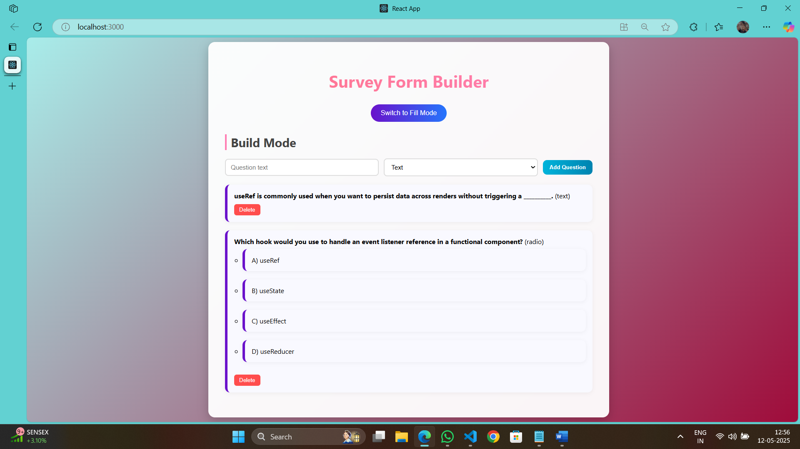
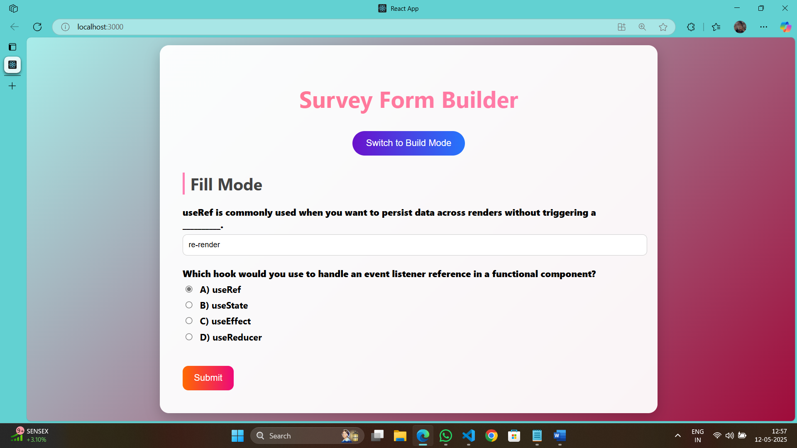

# Survey Form Builder (ReactJS)
## Date: 12/05/2025

## AIM
To create a Survey Form Builder using ReactJS..

## ALGORITHM
### STEP 1 Initialize States
mode ← 'build' (default mode)

questions ← [] (holds all survey questions)

currentQuestion ← { text: '', type: 'text', options: '' } (holds input while building)

editingIndex ← null (tracks which question is being edited)

responses ← {} (user responses to survey)

submitted ← false (indicates whether survey was submitted)

### STEP 2 Switch Modes
Toggle mode between 'build' and 'fill' when the toggle button is clicked.

Reset submitted to false when entering Fill Mode.

### STEP 3 Build Mode Logic
#### a. Add/Update Question
If currentQuestion.text is not empty:

If type is "radio" or "checkbox", split currentQuestion.options by commas → optionsArray.

Construct a questionObject:

If editingIndex is not null, replace question at that index.

Else, push questionObject into questions.

Reset currentQuestion and editingIndex.

#### b. Edit Question
Set currentQuestion to the selected question’s data.

Set editingIndex to the question’s index.

#### c. Delete Question
Remove the selected question from questions.

### STEP 4 Fill Mode Logic
#### a. Render Form
For each question in questions:

If type is "text", render a text input.

If type is "radio", render radio buttons for each option.

If type is "checkbox", render checkboxes.

#### b. Capture Responses
On input change:

For "text" and "radio", update responses[index] = value.

For "checkbox":

If option exists in responses[index], remove it.

Else, add it to the array.

### STEP 5 Submit Form
When user clicks "Submit":

Set submitted = true.

Display a summary using the questions and responses.

### STEP 6 Display Summary
Iterate over questions.

Display the response from responses[i] for each question:

If it's an array, join it with commas.

If empty, show "No response".


## PROGRAM

APP.JS
```
import React, { useState } from "react";
import "./App.css"; 
const App = () => {
  const [mode, setMode] = useState("build");
  const [questions, setQuestions] = useState([]);
  const [newQuestion, setNewQuestion] = useState({ text: "", type: "text", options: "" });
  const [responses, setResponses] = useState({});
  const [submitted, setSubmitted] = useState(false);

  const addQuestion = () => {
    if (!newQuestion.text) return;
    const question = {
      id: Date.now(),
      ...newQuestion,
      options:
        newQuestion.type === "text"
          ? []
          : newQuestion.options.split(",").map((opt) => opt.trim()),
    };
    setQuestions([...questions, question]);
    setNewQuestion({ text: "", type: "text", options: "" });
  };

  const deleteQuestion = (id) => {
    setQuestions(questions.filter((q) => q.id !== id));
  };

  const handleResponseChange = (id, value) => {
    setResponses({ ...responses, [id]: value });
  };

  const handleCheckboxChange = (id, option) => {
    const current = responses[id] || [];
    if (current.includes(option)) {
      setResponses({ ...responses, [id]: current.filter((o) => o !== option) });
    } else {
      setResponses({ ...responses, [id]: [...current, option] });
    }
  };

  const handleSubmit = (e) => {
    e.preventDefault();
    setSubmitted(true);
  };

  return (
    <div className="app">
      <h1>Survey Form Builder</h1>
      <button className="toggle-button" onClick={() => { setMode(mode === "build" ? "fill" : "build"); setSubmitted(false); }}>
        Switch to {mode === "build" ? "Fill Mode" : "Build Mode"}
      </button>

      {mode === "build" && (
        <div className="build-mode">
          <h2>Build Mode</h2>
          <div className="form-control">
            <input
              type="text"
              placeholder="Question text"
              value={newQuestion.text}
              onChange={(e) => setNewQuestion({ ...newQuestion, text: e.target.value })}
            />
            <select
              value={newQuestion.type}
              onChange={(e) => setNewQuestion({ ...newQuestion, type: e.target.value })}
            >
              <option value="text">Text</option>
              <option value="radio">Radio</option>
              <option value="checkbox">Checkbox</option>
            </select>
            {(newQuestion.type === "radio" || newQuestion.type === "checkbox") && (
              <input
                type="text"
                placeholder="Comma-separated options"
                value={newQuestion.options}
                onChange={(e) => setNewQuestion({ ...newQuestion, options: e.target.value })}
              />
            )}
            <button onClick={addQuestion}>Add Question</button>
          </div>
          <ul className="question-list">
            {questions.map((q) => (
              <li key={q.id}>
                <strong>{q.text}</strong> ({q.type})
                {q.options && q.options.length > 0 && (
                  <ul>
                    {q.options.map((opt, idx) => (
                      <li key={idx}>{opt}</li>
                    ))}
                  </ul>
                )}
                <button onClick={() => deleteQuestion(q.id)}>Delete</button>
              </li>
            ))}
          </ul>
        </div>
      )}

      {mode === "fill" && (
        <div className="fill-mode">
          <h2>Fill Mode</h2>
          <form onSubmit={handleSubmit}>
            {questions.map((q) => (
              <div key={q.id} className="form-group">
                <label><strong>{q.text}</strong></label>
                <div>
                  {q.type === "text" && (
                    <input
                      type="text"
                      onChange={(e) => handleResponseChange(q.id, e.target.value)}
                    />
                  )}
                  {q.type === "radio" &&
                    q.options.map((opt, idx) => (
                      <label key={idx}>
                        <input
                          type="radio"
                          name={q_${q.id}}
                          value={opt}
                          onChange={(e) => handleResponseChange(q.id, e.target.value)}
                        />{" "}
                        {opt}
                      </label>
                    ))}
                  {q.type === "checkbox" &&
                    q.options.map((opt, idx) => (
                      <label key={idx}>
                        <input
                          type="checkbox"
                          value={opt}
                          onChange={() => handleCheckboxChange(q.id, opt)}
                        />{" "}
                        {opt}
                      </label>
                    ))}
                </div>
              </div>
            ))}
            <button type="submit" className="submit-button">Submit</button>
          </form>

          {submitted && (
            <div className="summary">
              <h3>Responses Summary:</h3>
              <ul>
                {questions.map((q) => (
                  <li key={q.id}>
                    <strong>{q.text}:</strong>{" "}
                    {Array.isArray(responses[q.id])
                      ? responses[q.id].join(", ")
                      : responses[q.id]}
                  </li>
                ))}
              </ul>
            </div>
          )}
        </div>
      )}
    </div>
  );
};

export default App;
```

APP.CSS

```
body {
  margin: 0;
  padding: 0;
  font-family: 'Segoe UI', Tahoma, Geneva, Verdana, sans-serif;
  background: linear-gradient(135deg, #a8edea, #9f0b3a);
  min-height: 100vh;
  display: flex;
  align-items: center;
  justify-content: center;
}

.app {
  background-color: rgba(255, 255, 255, 0.95);
  width: 90%;
  max-width: 900px;
  padding: 40px;
  border-radius: 16px;
  box-shadow: 0 8px 24px rgba(0, 0, 0, 0.2);
  animation: fadeIn 0.6s ease-in-out;
}

@keyframes fadeIn {
  from {
    opacity: 0;
    transform: translateY(30px);
  }
  to {
    opacity: 1;
    transform: translateY(0);
  }
}

h1 {
  font-size: 2.5rem;
  text-align: center;
  background: linear-gradient(90deg, #ff758c, #ff7eb3);
  -webkit-background-clip: text;
  -webkit-text-fill-color: transparent;
  margin-bottom: 30px;
}

h2 {
  font-size: 1.8rem;
  color: #444;
  margin-top: 10px;
  margin-bottom: 20px;
  border-left: 4px solid #ff7eb3;
  padding-left: 10px;
}

.toggle-button {
  display: block;
  margin: 0 auto 30px auto;
  padding: 12px 24px;
  background: linear-gradient(90deg, #6a11cb, #2575fc);
  color: white;
  border: none;
  border-radius: 30px;
  font-size: 16px;
  cursor: pointer;
  transition: all 0.3s ease-in-out;
}

.toggle-button:hover {
  transform: scale(1.05);
  box-shadow: 0 0 12px rgba(106, 17, 203, 0.4);
}

.form-control {
  display: flex;
  flex-wrap: wrap;
  gap: 12px;
  margin-bottom: 20px;
  align-items: center;
}

.form-control input[type="text"],
.form-control select {
  flex: 1;
  padding: 10px 12px;
  border: 2px solid #ddd;
  border-radius: 8px;
  font-size: 15px;
  transition: border 0.3s, box-shadow 0.3s;
}

.form-control input[type="text"]:focus,
.form-control select:focus {
  border-color: #ff7eb3;
  box-shadow: 0 0 8px rgba(255, 126, 179, 0.3);
  outline: none;
}

.form-control button {
  padding: 10px 16px;
  background: linear-gradient(to right, #00b4db, #0083b0);
  color: white;
  border: none;
  border-radius: 10px;
  font-weight: bold;
  cursor: pointer;
  transition: all 0.3s ease-in-out;
}

.form-control button:hover {
  background: linear-gradient(to right, #43cea2, #185a9d);
  transform: scale(1.05);
}

.question-list {
  list-style: none;
  padding: 0;
  margin-top: 20px;
}

.question-list li {
  margin-bottom: 20px;
  padding: 16px;
  background-color: #f9f9ff;
  border-left: 6px solid #6a11cb;
  border-radius: 12px;
  box-shadow: 0 2px 10px rgba(0, 0, 0, 0.05);
}

.question-list ul {
  margin-top: 8px;
  padding-left: 20px;
}

.question-list button {
  background-color: #ff4d4d;
  color: white;
  padding: 6px 12px;
  border: none;
  border-radius: 6px;
  margin-top: 10px;
  cursor: pointer;
  transition: background 0.3s;
}

.question-list button:hover {
  background-color: #d93636;
}

.fill-mode .form-group {
  margin-bottom: 20px;
}

.fill-mode label {
  font-weight: bold;
  display: block;
  margin-bottom: 6px;
}

.fill-mode input[type="text"] {
  width: 100%;
  padding: 10px;
  border-radius: 8px;
  border: 1px solid #ccc;
  transition: border 0.3s ease;
}

.fill-mode input[type="text"]:focus {
  border-color: #2575fc;
  outline: none;
  box-shadow: 0 0 6px rgba(37, 117, 252, 0.3);
}

.fill-mode input[type="radio"],
.fill-mode input[type="checkbox"] {
  margin-right: 8px;
}

label {
  display: block;
  margin: 6px 0;
  cursor: pointer;
}

.submit-button {
  margin-top: 20px;
  background: linear-gradient(to right, #ff6a00, #ee0979);
  color: white;
  padding: 12px 20px;
  border: none;
  border-radius: 10px;
  font-size: 16px;
  cursor: pointer;
  transition: transform 0.3s ease-in-out;
}

.submit-button:hover {
  transform: scale(1.05);
}

.summary {
  margin-top: 30px;
  background-color: #fff5f8;
  border-left: 6px solid #ee0979;
  padding: 20px;
  border-radius: 10px;
  box-shadow: 0 3px 8px rgba(0, 0, 0, 0.05);
}

.summary h3 {
  color: #ee0979;
  margin-bottom: 12px;
}

.summary ul {
  padding-left: 20px;
  list-style: disc;
}
```
## OUTPUT





## RESULT
The program for creating Survey Form Builder using ReactJS is executed successfully.
